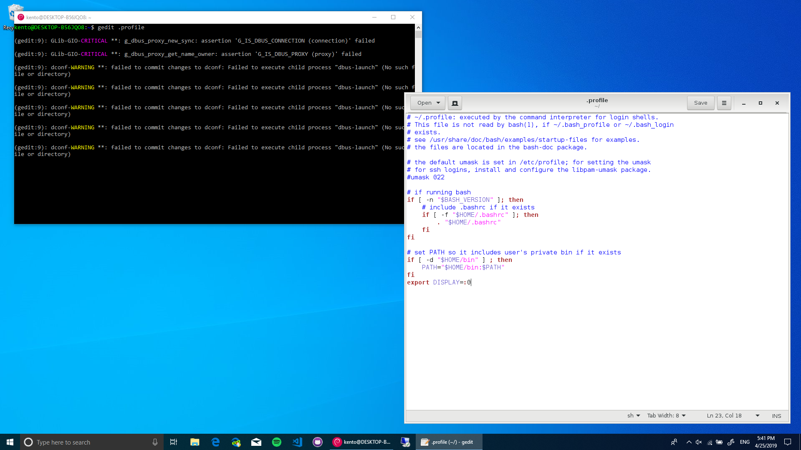
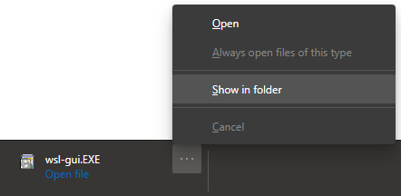
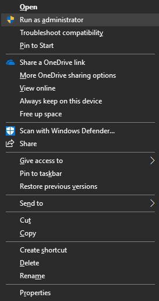
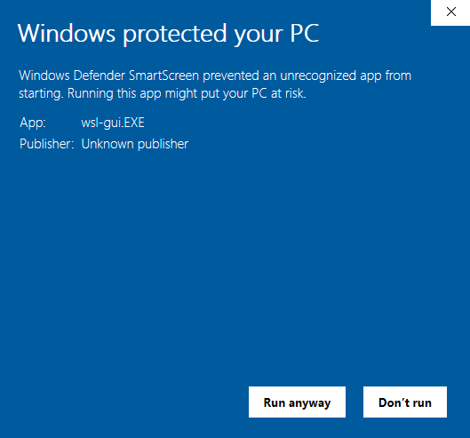
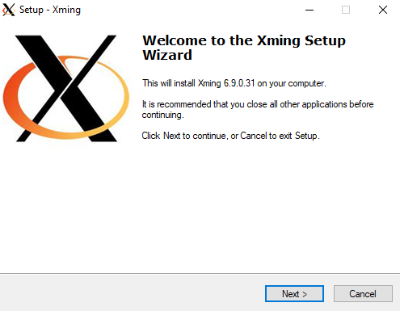
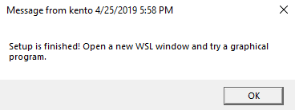

# WSL GUI
A tool to enable graphical applications in Windows Subsystem for Linux.

## About
WSL enables developers on Windows to use the Linux environment. This project expands upon the current implementation of WSL, enabling graphical apps on your favorite distro to run on your desktop. 

## Installation
1. Click [here](https://github.com/KentoNishi/WSL-GUI/raw/master/wsl-gui.EXE) to download the installer.
2. Expand the downloaded executable, and click "Show in Folder".

3. Right click the executable, and click "Run as administrator".

4. If a warning message appears, click "More info" and click "Run anyway".

5. Complete the Xming setup.

6. After a few moments, a message should appear, indicating success.

This message will close on it's own if left idle.
7. You are good to go! Open a new WSL window, and try opening a graphical application.

## Xming
Xming is an X Server for Windows. The installer will launch the Xming installer, to install this required package first.SS